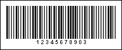

## Msi

The Msi barcode developed by the MSI Data Corporation. It is based on the original Plessey symbology. That`s why sometimes the Msi barcode is called the Modified Plessey. The basic implementation of the Msi barcode is used for warehouse shelves and inventory.

Valid symbols:

0123456789

Length:

Variable

Check digit:

none, one or two;

algorithm modulo-10 or modulo-11

Msi is a variable length continuous code, allows to display digits 0..9. One or two check digits calculated by the modulo-10 or modulo-11 algorithm can be used for control. Each barcode symbol has four elements. An element consists of a stroke and a gap and is 3 units wide. If an element represents binary 0, then the stroke has a width of 1 module, the gap is 2 modules. If an element represents binary 1, on the contrary, the stroke has a width of 2 modules, the gap is 1 module. Thus, each character is 12 modules wide. Therefore, this barcode has a very low data density.

A "Msi" barcode. "1234567890" is a number encoded in the barcode.
