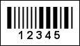

## Pharmacode

A **Pharmacode** barcode is used in the pharmaceutical industry as a packing control system. The Pharmacode barcode is most commonly found on the packaging of pharmaceutical products, usually on the hinged lid of the box.

| **Valid symbols:** | A whole number from 3 to 131070 |
| --- | --- |
| **Length:** | Variable, 1..6 characters of a digit |
| **Check digit:** | No |

A **Pharmacode** barcode can represent only a single integer from 3 to 131070. All digits in the specified range make correct barcodes, but some of these barcodes can be unreadable because all barcodes are identical. So, the following digits should not be used:

3, 6, 7, 14, 15, 30, 31, 62, 63, 126, 127, 254, 255, 510, 511, 1022, 1023, 2046, 2047, 4094, 4095, 8190, 8191, 16382, 16383, 32766, 32767, 65534, 65535, and 131070.

**A "Pharmacode" barcode. "12345" is a number encoded in the barcode.**
