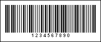

## Plessey

A Plessey barcode was created by Plessey company in England on March 1971 with formal specification. The Plessey barcode was widely used in libraries, supermarkets, and production environments. A variant of the barcode known as Anker Code and appropriate scanners were provided by the ADS company.

Encoding technology of the Plessey barcode was used by MSE Data Corporation. This company used it to create an MSI barcode that sometimes is called 'modified Plessey'.

This barcode is now obsolete and new scanners cannot read it.

| Valid symbols: | 0123456789ABCDEF |
| --- | --- |
| Length: | Variable |
| Check digit: | No, one or two; Algorithm modulo-10 or modulo-11 |

Plessey is a variable length, numeric-only symbology. It allows to output digits 0..9 and letters A, B, C, D, E, F but more frequently only digits are used. Check digits calculated using the modulo-10 or modulo-11 algorithm can be used. Each character of the barcode consists of 4 elements. An element consists of a bar and a space and has 3 modules width. If the element is the binary 0 then the barcode has 1 module width and a space has 2 modules. If the element is the binary 1 the bar has 2 module width and a space has 1 module. So, each character has 12 modules length. Therefore, this barcode has very low data density.

A "Plessey" barcode. "1234567890" is a number encoded in the barcode.
