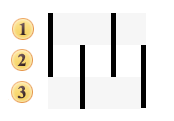
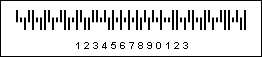

## Royal Mail 4-state

The Royal Mail 4-state barcode is used for automated mail sort process. Encoding is carried out in alphanumeric format (0-9, A-Z). There are 38 valid characters in the entire character set:

| Valid symbols: | numeric characters 0-9; alpha characters A-Z |
| --- | --- |
| Length: | Variable |
| Check digit: | none |

A barcode consists of four bars and divided into 3 regions, two of them are ascenders and two descenders. The tracking region is present in all bars. The picture below shows the structure of the Royal Mail 4-state barcode:

 Ascending Region;

 Tracking Region;

 Descending Region.

A Royal Mail 4-state Barcode. "1234567890123" is a number encoded in the barcode.
