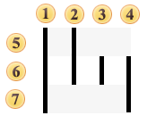

## Royal TPG Post KIX 4-State

This symbology is used by Royal Dutch TPG Post (Netherlands) for Postal code and automatic mail sorting. It provides information about the address of the receiver. This symbology encodes alpha-numeric characters (0-9, A-Z). The barcode is also known as Royal TNT Post Kix, Dutch KIX 4-State Barcode, Kix Barcode, TPG KIX, Klantenindex Barcode, TPGPOST KIX.

Valid symbols:

0123456789

ABCDEFGHIJKLMNOPQRSTUVWXYZ

Length:

Variable

Check digit:

none

The barcode consists of four types of bars and divided into 3 regions: ascender, tracker and descender. The Barcode structure is shown in the picture below:

 Full bar;

 Ascender;

 Tracker;

 Descender;

 Ascending Region;

 Tracking Region;

 Descending Region.

A Royal TPG Post KIX 4-State Barcode. "1234567890123" is a number encoded in the barcode.
