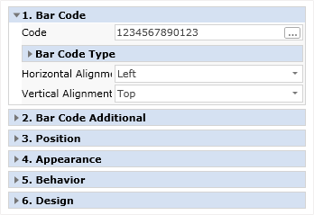
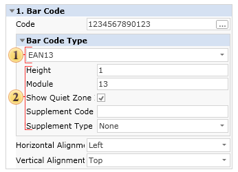

## Barcodes

A barcode is an optical machine-readable representation of data typically made up of parallel bars, varying in width, spacing, or height, which are read by barcode readers. In some cases, a line of digits can be placed under a barcode, which represents in human-readable form the data contained in the barcode. There are different ways to encode information, called bar code encoding or symbolics. Linear and two-dimensional symbolics are distinguished.

**1D Barcodes**

Most commonly, barcodes represent their data in the widths and spacings of printed parallel lines and spacings between them, this is why they are called linear or 1D (one-dimensional) barcodes or symbolics. Linear barcodes are read in one direction (horizontally). The following linear barcodes are commonly used:

* EAN;

* UPC;

* Code39;

* Code128;

* Codabar;

* Interleaved 2 of 5.

Linear symbolics allow coding of small amounts of information content (a maximum of 20-30 digits or symbols usually they are digits), and the devices that read them are considered to be simple scanners.

**2D Barcodes**

2D (two-dimensional) barcodes or symbolics are used for coding large amounts of information in a bar code, potentially up to several pages worth. They consist of square cells, dots, hexagons, and other geometrical figures, images, and they are called two-dimensional or **2D** matrix codes or symbolics. In spite of the absence of bar codes, they are bar codes too. Bar code scanners are required to read the barcodes which decode in two dimensions (horizontal and vertical) and allow you quickly and accurately to type a large amount of information. Such code is decoded in two measures (horizontally, vertically). The following 2D barcodes are the most common:

* **PDF417**;

* **Datamatrix.**

**Setting Barcode Data**

The Code property of the Barcode component is used to specify the code of the barcode.

This property is an expression, so it can be defined as both a literal string or a code calculation that can generate the barcode based on the content of a data field or any other calculation that may be applicable. For example, the code below is set as a string:

1234567890123

The Code read from a data field:

{Items.Code}

> **Information**
>
> When using the expression in the **Code** property in the design mode, the expression will be displayed. When viewing the report, it will be replaced by the necessary value.

**Using Barcode Components**

When using the Barcode components, you should remember that changing the sizes of those components within the designer does not lead to a change in the printed or displayed size of the barcodes. All barcodes have to meet a specified standard, or it would not be possible to read their data. In many barcodes changing the size of the code is either not allowed or has some limitations. For this reason, the size of a barcode is set using special properties. All these properties can be found in the Properties panel of the barcode. For example, in the picture below, the **Properties** panel of the EAN-128a barcode is shown. This particular barcode allows the user to set the **BarcodeHeight** and **BarCodeModules**.

 The barcode type.

 The barcode properties.
