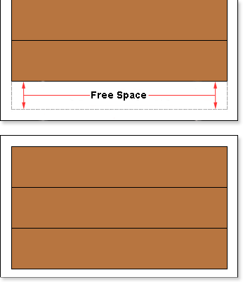
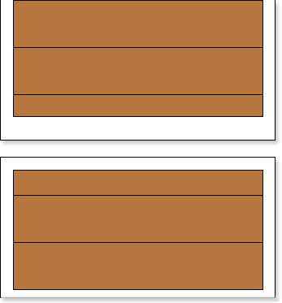

## Breaking Bands

How to use the **CanBreak** property of bands. The picture below shows two pages of a rendered report, which has 5 bands. The picture shows: the first and the second bands are output on the first page. The third band could not fit the bottom of the first page, so it was moved to the next page, along with the fourth and fifth bands.

In this case, free space available remained on the first page of the report, because the band could not fit entirely and was moved to with the report engine to the next page. If to set the **CanBreak** property to **true**, then this will be "broken. The picture below shows how the of the third band is broken.

In this case we see that the third band could not fit, so it was broken: one part was left on the first page, and the second was moved to the next page, respectively. So all the space of the page was used. It should also take into account that the band may not fit within a single page. If the **CanBreak** is set to **false**, then it will be moved to the next page. If, on the next page, the band does not fit completely, it will be forcibly broken. You should know that special bands are displayed on the first page, and the remaining space of the page will be used to output the broken band. It is worth noting that the band may be output on more than one page. There are no limitations on the number of pages in which parts of the broken band can be output. By default, the **CanBreak** property is set to **false**.
