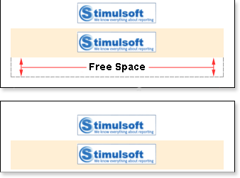

## Breaking Images

In some cases the Image does not fit one page. So the image will be moved to the next page.

As you can see on the picture above, free space remained on the first page. To avoid this, set the CanBreak property to true. And then,  the Image component will be broken, as seen on the picture below:

As shown in the picture above, the Image component was broken, a part of it remained on the first page, and the other was moved to the next page. Also note that the breaking of the Image component will not work if the CanBreak property of the band, in what the Image component is placed, is set to false, because the band will be moved entirely to the next page. So the Image component will be moved together with the band. So, if you need the Image to be broken, then values of CanBreak properties for the Image and the band should be set to true.
