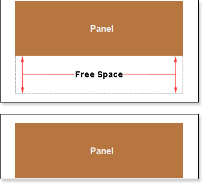
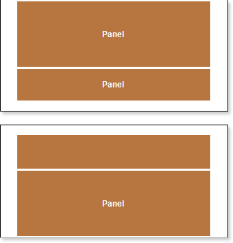

## Breaking Panels

Sometimes, in a report template, where the Panel is used, all data cannot fit one page. If the CanBreak property is set to false, then a report, may look like on the picture below.

As shown in the picture above, the Panel was moved to another page, and free blank space remained on the previous page. If the CanBreak property is set to true, then the report may look like on the picture below:

As shown in the picture above, the Panel was broken, a part of it remained on the first page, and the other was moved to the next page. It should also take into account that the panel may not fit a single page. If to set the CanBreak property to false, then it will be moved to the next page. If on the next page the panel does not fit completely, it will be forcibly broken. You should know that special bands are displayed on the first page, and the remaining space of the page will be used to output the broken panel. It is worth noting that the panel may be output on more than one page. There are no limitations on the number of pages in which parts of the broken panel can be output. By default, the CanBreak property is set to false.
