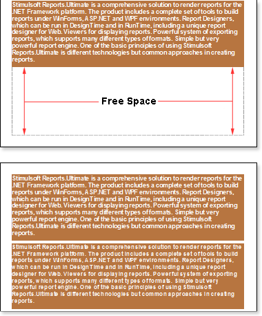
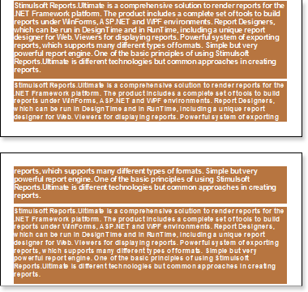

## Breaking RichText

By default, the CanBreak property of the RichText component is set to false. Such a text component will not be broken, if it is not enough space to print it on one page, and would be moved to the next page.

As you can see on the picture above, on the free space remained  at the bottom of the first page. To avoid this, set the CanBreak property  to true. And then, a component of the RichText will be broken (see the picture below):

As shown in the picture above, the RichText was broken, a part of it remained on the first page, and the other was moved to the next page. It should also take into account that the component may not fit a single page. You should know that the text component is broken rowwise. Also note that the breaking of the text component will not work if the CanBreak property of the band, in what the text component is placed, is set to false, because the band will be moved entirely to the next page. So the text component will be moved together with the band. So, if you need the text component to be broken, then values of CanBreak properties for the text component and the band should be set to true.
