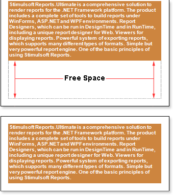

## Breaking Text

By default, the CanBreak property of the Text component is set to false. Such a Text component will not be broken if it is not enough space to print on one page, and would be moved to the next page.

As seen on the picture above, free space left at the bottom of the first page. To avoid this, set the CanBreak property to true. And then, a Text component is broken, for example, as shown on a picture below:

In this case, a Text component could not fit entirely on the bottom of a page, so it was broken. A part of the component remains on the same page, and another part was moved to the next one. Note that the text component is broken by row. Small amount of free space remains, as report generator must output the full height of a row and the text remains readable. Also note that the break of the text component will not work if the CanBreak property in a container, which has a text component, is set to false. Because the container would be moved to the next page completely. Accordingly, together with it, a text component will be transferred and the break will not work. So, if you need a break, then set the CanBreak property to true for the Text component and container to what the text component is placed.
