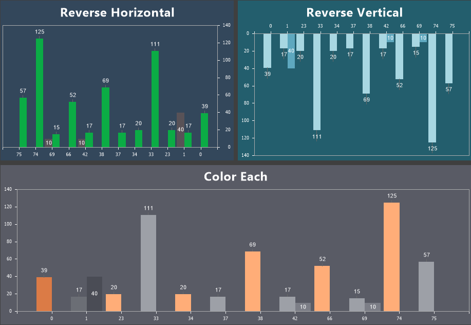

## Common

The Common tab contains settings related to the chart area.

To configure the chart area, you need:
* Open the component editor and go to the **Area** tab, then select the **Common** tab;
* Set the desired property values.

Below is a table of properties used to configure the chart area.

| **Name** | **Description** |
| --- | --- |
| Allow Apply Style | Enables the use of chart style settings for the area design. If set to **True**, the area styling will be inherited from the selected chart style. If set to **False**, additional properties become available, allowing customization of the area’s appearance, such as border color, brush type, background color, and shadow display. |
| Color Each | Allows assigning a unique shade to each graphical element of the chart. If set to **True**, colors from the style collection will be applied to graphical elements individually. Once all colors in the collection are used, the remaining elements will be assigned lighter variations of these colors. This ensures each graphical element has a distinct shade. If set to **False**, all graphical elements in the same series will share a single color from the style collection. |
| Reverse Horizontal | Enables horizontal mirroring of the chart area. If set to **True**, the area will be displayed in a reversed horizontal orientation. If set to **False**, the chart will be displayed in its default orientation. |
| Reverse Vertical | Enables vertical mirroring of the chart area. If set to True, the area will be displayed in a reversed vertical orientation. If set to **False**, the chart will be displayed in its default orientation.Enables vertical mirroring of the chart area. If set to **True**, the area will be displayed in a reversed vertical orientation. If set to False, the chart will be displayed in its default orientation. |
