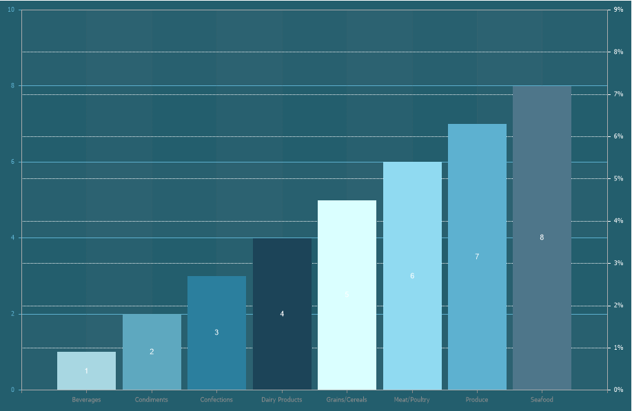

## Grid Lines Right Horizontal

**Grid Lines Horizontal Right** are lines in the chart area corresponding to each value of the right Y-axis, running parallel to the X-axis. In other words, a line of a specific style and color will extend from each value of the right Y-axis to the opposite edge of the chart area, parallel to the X-axis.

To set up right horizontal grid lines in the chart area, you need:
* In the component editor, navigate to the **Area** tab and select the **Grid Lines Horizontal Right** section;
* Set the required property values.

> **Information**
>
> The chart area can also display minor right horizontal grid lines.

Below is a table of properties used to configure right horizontal grid lines.

| **Name** | **Description** |
| --- | --- |
| Allow Apply Style | Enables the use of right horizontal grid line styling settings from the chart style. If this property is set to **True**, the styling settings for right horizontal grid lines will be taken from the selected chart style. If set to **False**, additional properties will be displayed, allowing customization of the main and minor grid line styles and colors. |
| Color | Allows selecting the color of the main right horizontal grid lines. |
| Minor Color | Allows selecting the color of the minor right horizontal grid lines. |
| Minor Count | Sets the number of minor right horizontal grid lines. Minor lines are displayed between the main grid lines at equal intervals. |
| Minor Style | Defines the style of minor right grid lines: **Solid**, **Dash**, **Dash Dot**, **Dash Dot Dot**, **Dot**, **Double**. If set to **None**, minor grid lines will not be displayed. |
| Minor Visible | Enables or disables the display of minor right grid lines. If set to **True**, minor grid lines will be shown. If set to **False**, they will be hidden. |
| Style | Defines the style of the main right grid lines: **Solid**, **Dash**, **Dash Dot**, **Dash Dot Dot**, **Dot**, **Double**. If set to **None**, neither main nor minor grid lines will be displayed. |
| Visible | Enables or disables the display of the main right grid lines. If set to **True**, the main lines will be displayed. If set to **False**, they will be hidden. |
