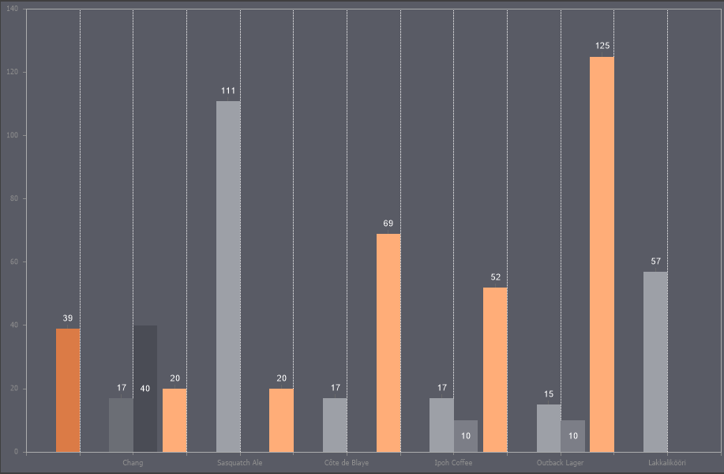

## Grid Lines Vertical

Grid Lines Vertical are lines in the chart area corresponding to each X-axis value, running parallel to the Y-axis. In other words, a line of a specific style and color will extend from each X-axis value to the opposite edge of the chart area, parallel to the Y-axis.

To set up vertical grid lines in the chart area, you need:
* In the component editor, navigate to the Area tab and select the Grid Lines Vertical section;
* Set the required property values.

> **Information**
>
> The chart area can also display minor vertical grid lines.

Below is a table of properties used to configure vertical grid lines.

Name

Description

Allow Apply Style

Enables the use of vertical grid line styling settings from the chart style. If this property is set to True, the styling settings for vertical grid lines will be taken from the selected chart style. If set to False, additional properties will be displayed, allowing customization of the main and minor grid line styles and colors.

Color

Allows selecting the color of the main vertical grid lines.

Minor Color

Allows selecting the color of the minor vertical grid lines.

Minor Count

Sets the number of minor vertical grid lines. Minor lines are displayed between the main grid lines at equal intervals.

Minor Style

Defines the style of minor grid lines: Solid, Dash, Dash Dot, Dash Dot Dot, Dot, Double. If set to None, minor grid lines will not be displayed.

Minor Visible

Enables or disables the display of minor grid lines. If set to True, minor grid lines will be shown. If set to False, they will be hidden.

Style

Defines the style of the main grid lines: Solid, Dash, Dash Dot, Dash Dot Dot, Dot, Double. If set to None, neither main nor minor grid lines will be displayed.

Visible

Enables or disables the display of the main grid lines. If set to True, the main lines will be displayed. If set to False, they will be hidden.
