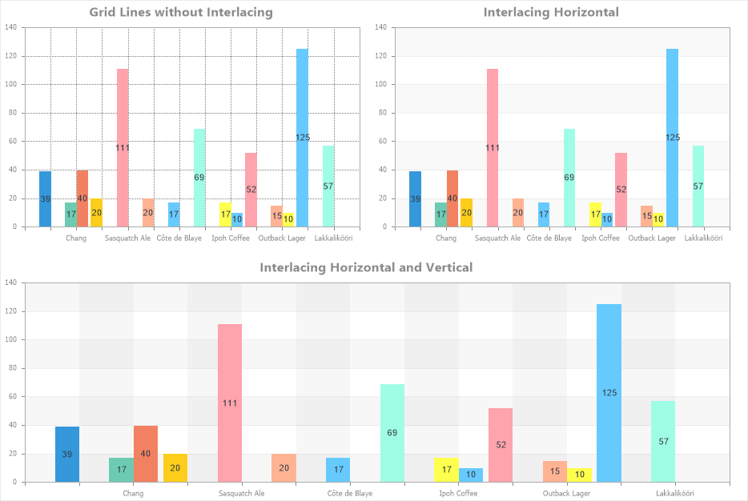

## Interlacing Horizontal

Interlacing Vertical is the process of filling every second vertical gap between the Y-axis values across the entire chart area. Horizontal filling can alternate with vertical filling.

To configure interlacing vertical in the chart area, you need:
* In the component editor, navigate to the Area tab and select the Interlacing Horizontal section;
* Set the required property values.

Below is a table of properties used to configure interlacing vertical.

| Name | Description |
| --- | --- |
| Allow Apply Style | Enables the use of interlacing horizontal styling settings from the chart style. If this property is set to True, the styling settings for interlacing horizontal will be taken from the selected chart style. If set to False, additional properties will be displayed, allowing you to customize interlacing horizontal appearance, such as brush type and colors. |
| Interlaced Brush | A group of properties that allows configuring the brush type and fill colors for horizontal gaps. This group is visible only when Allow Apply Style is set to False. |
| Visible | Enables or disables filling horizontal gaps with color. If set to True, the horizontal gaps will be filled with a specified color. If set to False, the horizontal gaps will not be filled. |
