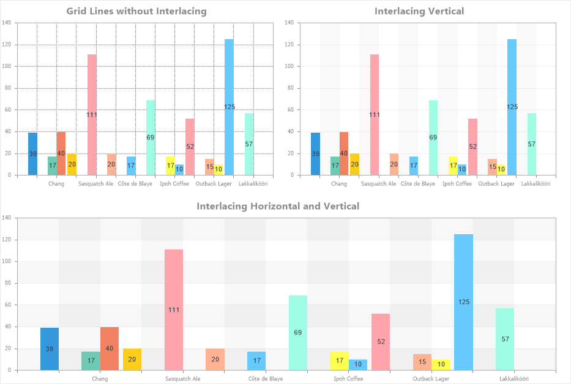

## Interlacing Vertical

Interlacing Vertical is the process of filling every second vertical gap between the X-axis values across the entire chart area. Vertical filling can alternate with horizontal filling.

To configure interlacing vertical in the chart area, you need:
* In the component editor, navigate to the Area tab and select the Interlacing Vertical section;
* Set the required property values.

Below is a table of properties used to configure interlacing vertical.

Name

Description

Allow Apply Style

Enables the use of interlacing vertical styling settings from the chart style. If this property is set to True, the styling settings for interlacing vertical will be taken from the selected chart style. If set to False, additional properties will be displayed, allowing you to customize interlacing vertical appearance, such as brush type and colors.

Interlaced Brush

A group of properties that allows configuring the brush type and fill colors for vertical gaps. This group is visible only when Allow Apply Style is set to False.

Visible

Enables or disables filling vertical gaps with color. If set to True, the vertical gaps will be filled with a specified color. If set to False, the vertical gaps will not be filled.
