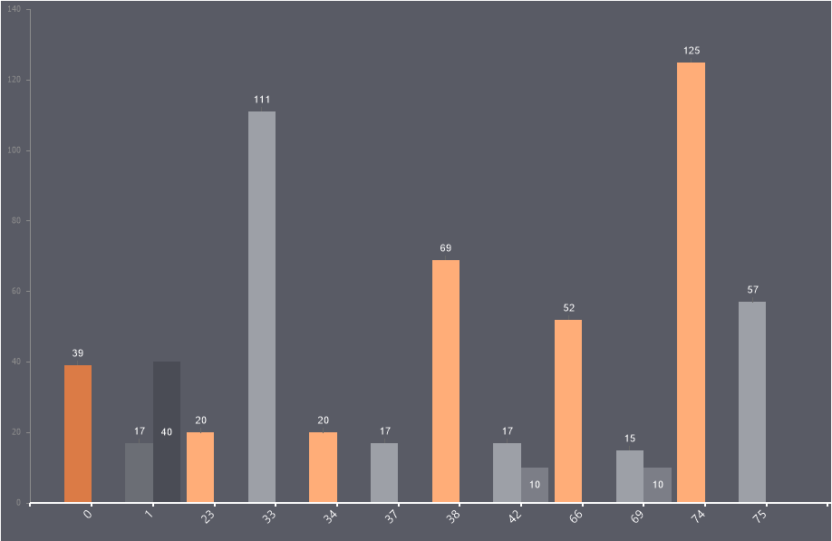

## Y Axis

The **Y Axis** tab contains settings for the argument axis and its labels.

To configure the Y Axis of the chart, you need:
* Open the component editor and go to the **Area** tab, then select the **Y Axis** tab;
* Set the desired property values.

Below is a table of properties used to configure the **Y** **Axis**.

| **Name** | **Description** |
| --- | --- |
| Allow Apply Style | Enables the use of chart style settings for the Y axis. If set to **True**, the Y axis styling will be inherited from the selected chart style. If set to **False**, additional properties become available, allowing customization of the Y axis appearance, such as line color.. |
| Arrow Style | Allows selecting the style of the axis arrow: **Triangle**, **Lines**, **Circle**, **Arc**, **Arc and Circle**. If set to **None**, no arrow style |
| Interaction | A group of properties for configuring interaction with the Y axis: The **Range Scroll Enabled** property allows enabling scrolling for the Y axis labels. If set to **True**, the Y axis length will accommodate all labels, but the visible range will be limited by the component size. Users can scroll to view the full range. If set to **False**, the Y axis will be constrained by the component size, and labels will be selectively displayed. The **Show Scroll Bar** property enables or disables the display of the scrollbar. If set to **True**, the scrollbar will be shown. If set to **False**, it will be hidden.. |
| Labels | The Labels property group allows configuring the titles (labels) of the Y axis. The **Allow Apply Style** property enables applying label styling (color, font) from the chart style or manually configuring them using individual properties. The **Antialiasing** property enables or disables antialiasing for Y axis labels. The **Color** property allows selecting the color of the Y axis labels if **Allow Apply Style** is set to **False**. The **Font** property a group of properties that defines the font family, size, and style for Y axis labels if **Allow Apply Style** is set to **False**. The **Angle** property rotates the Y axis labels by a specified angle in degrees. The **Format** property allows selecting a format mask for the Y axis labels. The **Placement** property determines the arrangement of Y axis labels (single line, two lines, or hidden). The **Step** property sets the interval for displaying labels, e.g., every second, third argument, etc. The **Text After** property specifies text to be added after the labels. The **Text Alignment** property sets the text alignment of the labels: left, right, or center. The **Text Before** property specifies text to be added before the labels. The **Width** property sets the width of the Y axis labels in pixels. By default, it is 0, meaning auto-width is enabled. The **Word Wrap** property enables word wrapping for labels. If set to **True**, text wraps to the next line when reaching the maximum width, increasing the label height. If set to **False**, text will be truncated at the boundary. |
| Line Style | Allows selecting the Y axis line style: **Solid**, **Dash**, **Dash Dot**, **Dash Dot Dot**, **Dot**, **Double** |
| Line Width | Sets the thickness of the Y axis line, measured in pixels.. |
| Logarithmic Scale | Allows enabling or disabling the display of a logarithmic scale on the Y axis. If set to **True**, the logarithmic scale will be displayed. If set to **False**, the logarithmic scale will not be displayed. |
| Range | A property group that allows configuring the range of values on the Y axis. The **Auto** property enables or disables automatic range calculation for the Y axis. If set to **True**, the range is calculated automatically. If set to **False**, the range is not calculated automatically, and the **Minimum** and **Maximum** values must be manually specified. The **Minimum** property value defines the starting value in the Y axis range. The **Maximum** property value defines the ending value in the Y axis range. |
| Show Y Axis | Allows selecting the display mode for the Y axis: **Bottom**, **Center**, **Both**. |
| Start form Zero | Allows setting zero as the starting point of the Y axis. If set to **True**, Y axis values will start from 0. If set to **False**, the first value in the series will be the starting point of the Y axis. |
| Ticks | A property group that allows configuring the tick marks on the Y axis. The **Length** property sets the length of major tick marks in pixels. The **Length under Labels** property sets the length of intermediate lines under the Y axis labels. The **Minor Count** property sets the number of minor tick marks between major tick marks. The space between major tick marks will be divided accordingly, ensuring evenly spaced minor ticks. The **Minor Length** property sets the length of minor tick marks in pixels. The **Minor Visible** property allows enabling or disabling the display of minor grid lines. If set to **True**, minor grid lines will be displayed. If set to **False**, minor grid lines will not be displayed. The **Step** property allows setting the interval for displaying major tick marks. The **Visible** property allows enabling or disabling the display of tick marks (both major and minor). If set to **True**, tick marks will be displayed. If set to False, tick marks will not be displayed. |
| Title | A property group that allows configuring the Y axis title. The **Allow Apply Style** property allows applying title styling (color, font) from the chart style or manually configuring them using individual properties. The **Antialiasing** property enables or disables antialiasing for the Y axis title text. The **Color** property allows selecting the color of the Y axis title if **Allow Apply Style** is set to **False**. The **Font** a group of properties that defines the font family, size, and style of the Y axis title if **Allow Apply Style** is set to **False**. The **Alignment** property sets the title alignment: **Far**, **Near**, **Center**. The **Direction** property sets the text direction of the axis title: **Left to Right**, **Right to Left**, **Top to Bottom**, **Bottom to Top**. The **Position** property allows selecting the position of the Y-axis title: **Inside** or **Outside** the chart area. The **Text** property allows setting the text that will be used as the Y-axis title. |
| Visible | Allows enabling or disabling the display of the Y-axis. If set to True, the Y-axis will be displayed. If set to False, the Y-axis will not be displayed. |
