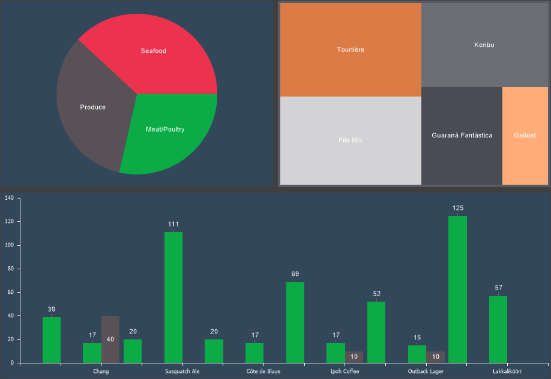

## Area

The Area is the space within a chart component where graphical elements of the chart are displayed. The settings for the area elements are grouped, with each group represented by a separate tab.

Depending on the chart type, the area type can be:
* With axes – when the area includes X and Y axes. Examples: histogram, line chart, radar chart, etc.
* Without axes – when the area does not contain X and Y axes. Examples: tree map, pie chart, donut chart, etc.

> **Information**
>
> Depending on whether the area has axes or not, the number of setting tabs in the Area tab may vary.

The Area tab contains a preview panel and may include the following setting tabs:
* Common provides general settings for the chart area;
* X-Axis contains settings for the argument axis in the chart area;
* Y-Axis contains settings for the value axis in the chart area;
* Top X-Axis contains settings for the upper argument axis in the chart area;
* Right Y-Axis contains settings for the right value axis in the chart area;
* Horizontal Grid Lines contains settings for the horizontal grid lines in the chart area;

* Vertical Grid Lines contains settings for the vertical grid lines in the chart area;
* Right Horizontal Grid Lines contains settings for the right horizontal grid lines in the chart area;
* Horizontal Alternation contains settings for horizontal alternation in the chart area;
* Vertical Alternation contains settings for vertical alternation in the chart area.
