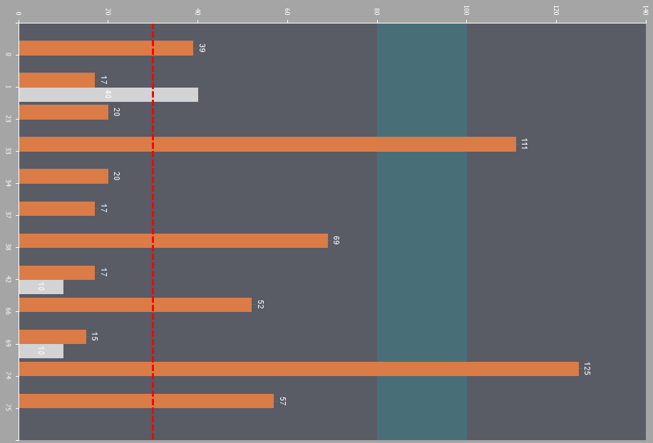

## Common

The Common sub-tab includes settings related to the Chart component.

All settings for the Chart component are represented as properties. These properties are also duplicated in the Properties Panel in the report designer. You can adjust the chart's general settings either:
* In the component editor, under the Chart tab on the Common sub-tab;
* Select the Chart component in the report template and changing property values in the Properties Panel of the report designer.

Below is a table of properties used to configure the Chart component:

Name

Description

Allow Apply Style

Enables applying chart design settings from a style. If set to True, the chart's design settings will be inherited from the selected chart style. If set to False, design settings will be taken from the chart's elements.

Process At End

Allows configuring the processing mode for the chart. If set to True, the chart will be processed after all other report components. If set to False, the chart will be processed sequentially.

Rotation

Allows rotating the chart by 90 or 180 degrees or flipping it vertically or horizontally.

Horizontal Spacing

Defines internal horizontal spacing from the component's borders to the chart area.

Vertical Spacing

Defines internal vertical spacing from the component's borders to the chart area.

Data Source

Assigns the chart's data source. If the chart in the report is used for detailing specific data, for example, and is located on the Data Band, the data source should be specified.

Data Relation

Specifies the relationship between the chart's data source and the main data source in the report.

Master Component

Allows assigning a master component to the chart for creating master-detail reports, where the chart represents detailed data.

Count Data

Sets the number of rows in the virtual data source.

Filter On

Enables or disables the application of chart filters. If set to True, the collection from the Filters property will be applied. If set to False, the collection will not be applied.

Filters

Allows specifying a collection of filters for columns in the assigned data source.

Sort

Allows setting data sorting for columns in the assigned data source.
