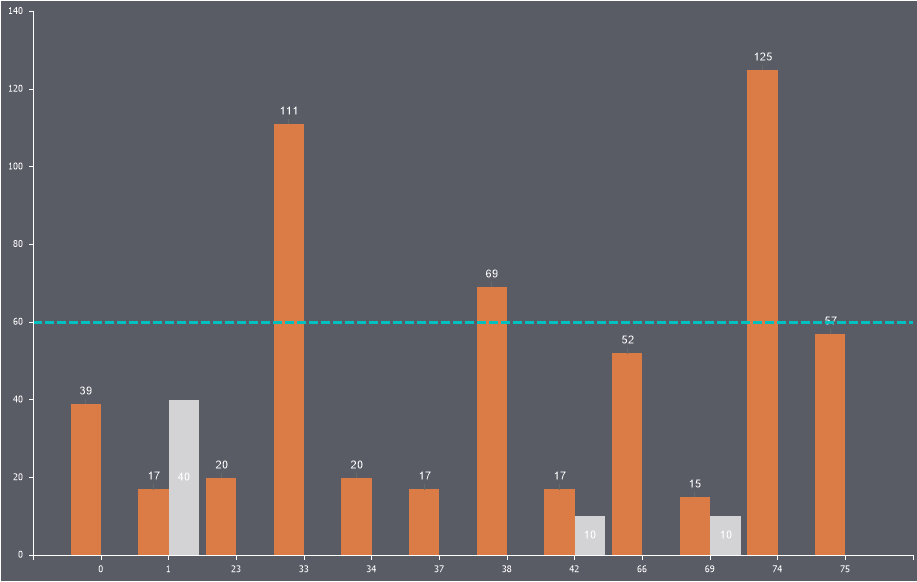

## Constant Lines

**Constant Lines** are horizontal or vertical lines on a chart that represent a specific value on the axis.

To add a constant line:

* In the component editor, go to the **Chart** tab and select the **Constant Lines** sub-tab;
* Click the **Add Constant Line** button;
* Configure the line using the available properties.

> **Information**
>
> The number of constant lines on a chart is unlimited.

Below is a table of properties for configuring constant lines:

| **Name** | **Description** |
| --- | --- |
| Allow Apply Style | Enables applying design settings for the constant line from the chart style. If set to **True**, the line design will inherit the selected chart style. If set to **False**, additional properties will appear for customizing the line's appearance, such as line color, smoothing, font type, size, and family. |
| Axis Valu | Specifies the axis value through which the line is drawn. |
| Line Style | Allows changing the style of the constant line. |
| Line Width | Defines the width of the constant line in pixels. |
| Orientation | Allows selecting the line's orientation: **Horizontal**, **Vertical**, or **Horizontal Right**. |
| Position | Specifies the position of the constant line's text. |
| Show Behind | Determines whether the constant line is displayed behind or in front of the chart's graphic elements. If set to **True**, the line will appear behind the elements. If set to **False**, it will appear on top of the graphic elements. |
| Text | Allows defining the text for the constant line. |
| Title Visible | Toggles the visibility of the constant line's text. If set to **True**, the text will be displayed. If set to **False**, the text will not appear. |
| Visible | Toggles the visibility of the constant line. If set to **True**, the constant line will be displayed on the chart. If set to **False**, it will not appear. |
