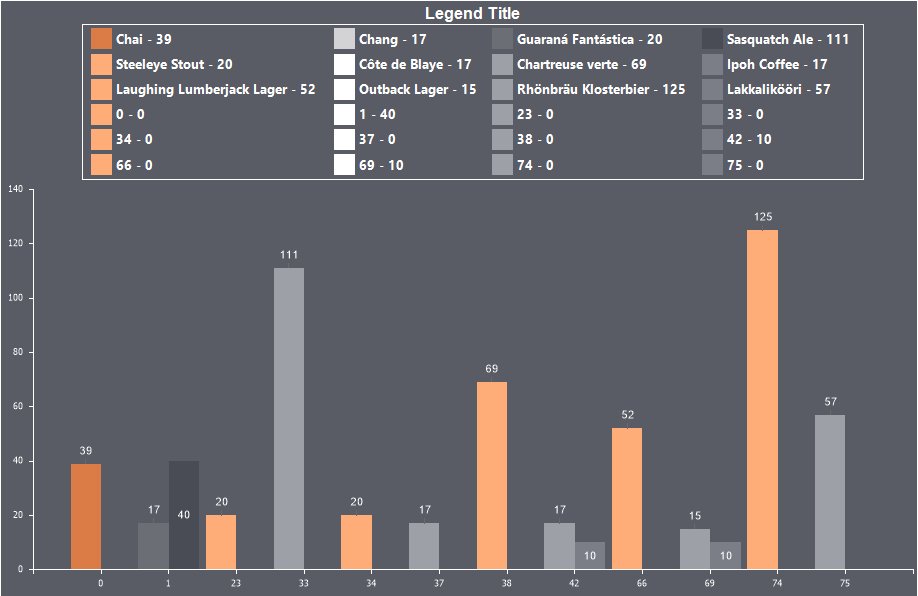

## Legend

The Legend is the area where the legend items for different data series in the chart are displayed. The legend can be placed in various parts of the chart: either within the chart area or outside of it.

The legend settings can be configured:

* In the Chart tab, under the Legend sub-tab, using properties.
* However, the type and format of the values are defined in the Labels tab, under the Common sub-tab.

Below is a table of properties used to configure the chart legend:

| Name | Description |
| --- | --- |
| Allow Apply Style | Enables applying legend styling from a chart style. If set to True, the legend's design settings will be inherited from the selected chart style. If set to False, additional properties for customizing the legend will become available, such as border color, font, brush and background color, title font and color, and shadow display. |
| Columns | Specifies the number of columns for legend values. |
| Direction | Defines the direction of how the columns in the legend are filled with values. |
| Hide Series with Empty Title | Toggles the display of series without a title in the legend. If set to True, series without a title will not be shown. If set to False, all series will be displayed. |
| Horizontal Alignment | Specifies the horizontal position of the legend within the chart component. The legend can be placed inside or outside the chart area. |
| Horizontal Spacing | Defines the horizontal spacing between the legend elements. |
| Marker Alignment | Specifies the position of the marker within the legend. |
| Marker Border | Toggles the display of a border around the marker. If set to True, the marker border will be visible. If set to False, the marker border will not be shown. |
| Marker Size | Specifies the size of the marker in pixels for both width and height. |
| Marker Visible | Toggles the visibility of the marker in the legend. If set to True, the marker will be displayed. If set to False, it will not be shown. |
| Size | Sets the width and height of the legend in report units. By default, the size properties are set to 0, which enables the auto-sizing mode, allowing the legend to adjust its size to fit all legend values. |
| Title | Specifies the title of the legend. By default, the value is empty, meaning the legend has no title. |
| Vertical Alignment | Specifies the vertical position of the legend within the chart component. The legend can be placed inside or outside the chart area. |
| Vertical Spacing | Defines the vertical spacing between the legend elements. |
| Visible | Toggles the visibility of the legend on the chart. If set to True, the legend will be displayed. If set to False, the legend will not be shown. |
