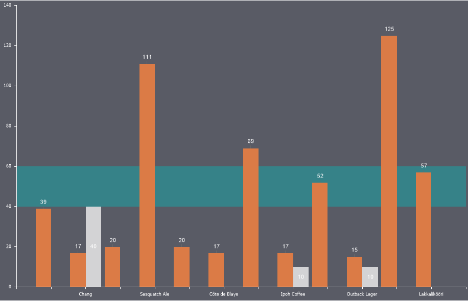

## Strips

**Strips** are horizontal or vertical ranges of values highlighted with a specific color.

To add a strip:

* In the component editor, go to the **Chart** tab and select the **Strips** sub-tab;
* Click the **Add Strip** button;
* Configure the strip using the available properties.

> **Information**
>
> The number of strips on a chart is unlimited.

Below is a table of properties for configuring strips:

| **Name** | **Description** |
| --- | --- |
| Allow Apply Style | Enables applying design settings for the strip from the chart style. If set to **True**, the strip design will inherit the selected chart style. If set to **False**, additional properties will appear for customizing the strip's appearance, such as the brush, strip color, smoothing, and title font type, size, family, and color. |
| Max Value | Allows defining the maximum value of the strip, i.e., the value up to which the area will be filled with the strip's color. |
| Min Value | Allows defining the minimum value of the strip, i.e., the value from which the area will be filled with the strip's color. |
| Orientation | Allows selecting the strip's orientation: Horizontal, Vertical, or Horizontal Right. |
| Show Behind | Determines whether the strip is displayed behind or in front of the chart's graphic elements. If set to **True**, the strip will appear behind the elements. If set to **False**, it will appear on top of the graphic elements. |
| Text | Allows defining the title text for the strip. |
| Title Visible | Toggles the visibility of the strip's title text. If set to **True**, the title text will be displayed. If set to **False**, the title text will not appear. |
| Visible | Toggles the visibility of the strip. If set to **True**, the strip will be displayed on the chart. If set to **False**, it will not appear. |
