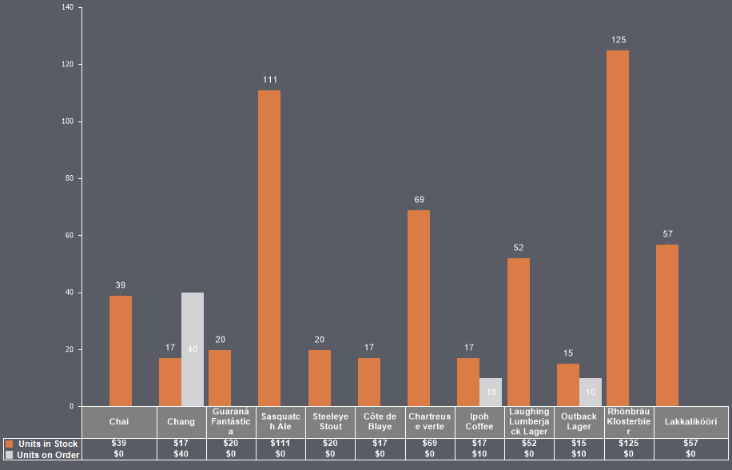

## Table

A **Table** on the chart is a list of values of graphical elements in a series in relation to their arguments.

To enable the chart’s value table:

* In the component editor, go to the **Chart** tab and select the **Table** sub-tab;
* Set the **Visible** property to **True**;
* Configure the table using the available properties.

> **Information**
>
> The table is displayed below the argument axis and can be positioned at the bottom, top, left, or right, depending on the argument's placement. Rows (in horizontal layout) or columns (in vertical layout) will display series and their values.

Below is a table of properties for configuring the chart's value table:

| **Name** | **Description** |
| --- | --- |
| Allow Apply Style | Enables applying table design settings from the chart style. If set to **True**, the table’s design will inherit the selected chart style. If set to **False**, additional properties for customizing the grid line color will become available. |
| Data Cells | A group of properties for configuring the data cells (i.e., the series values). You can set the text color and adjust the font type, size, and family. Additionally, you can specify the minimum font size and enable cell compression to fit the minimum font size. |
| Format | Allows selecting the value format mask in the table. |
| Grid Lines Horizontal | Enables or disables the display of horizontal grid lines in the table. If set to **True**, horizontal lines will be displayed. If set to **False**, they will not appear. |
| Grid Lines Vertical | Enables or disables the display of vertical grid lines in the table. If set to **True**, vertical lines will be displayed. If set to **False**, they will not appear. |
| Grid Outline | Enables or disables the display of the table’s border outline. If set to **True**, the table’s border outline will be displayed. If set to **False**, it will not appear. |
| Header | A group of properties for configuring the table’s header, which consists of the X-axis labels (i.e., chart arguments). You can add text suffixes, change text color, background color, font type, size, and family, and enable word wrapping. If the **Word** **Wrap** property is set to **True**, headers will wrap, and header cells may increase in height. If set to **False**, headers will not wrap, and text will be truncated at the right edge of the header cell. |
| Marker Visible | Enables or disables the display of series markers. If set to **True**, series markers will be displayed. If set to **False**, they will not appear. |
| Visible | Enables or disables the display of the value table. If set to **True**, the value table will be displayed on the chart. If set to **False**, it will not appear. |
