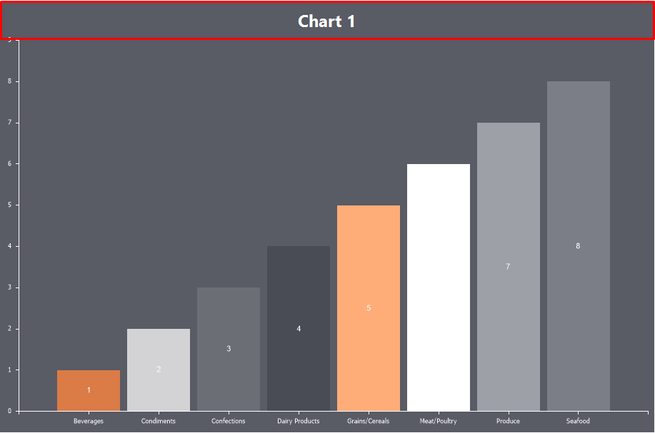

## Title

The Title is text that represents the name of the chart or provides an explanation for it.

To configure the title, go to the Chart tab in the component editor and select the Title sub-tab. Then, use the properties to define and customize the title.

> **Information**
>
> You can also create component titles when designing reports using text components. For example, you can place a TextBox component on the Chart component, enabling the Link and Lock properties.

Below is a table of properties used to configure the chart title:

| Name | Description |
| --- | --- |
| Allow Apply Style | Enables applying title design settings from the chart style. If set to True, the title design settings will be inherited from the selected chart style. If set to False, additional properties will be available to customize the title's appearance, such as smoothing, brush and text color, font type, size, and family. |
| Alignment | Allows you to define the title alignment: Far, Center, or Near. |
| Dock | Specifies the type of docking for the title relative to the chart: Top, Right, Bottom, or Left. |
| Spacing | Defines the internal padding between the title and the outer boundary of the chart component and the chart area. |
| Text | Allows you to specify the title text. Any text entered in this field will appear as the chart title. By default, the field is empty, meaning no title is set. |
| Visible | Toggles the visibility of the title. If set to True, the chart title will be displayed. If set to False, the chart title will not be shown. |
