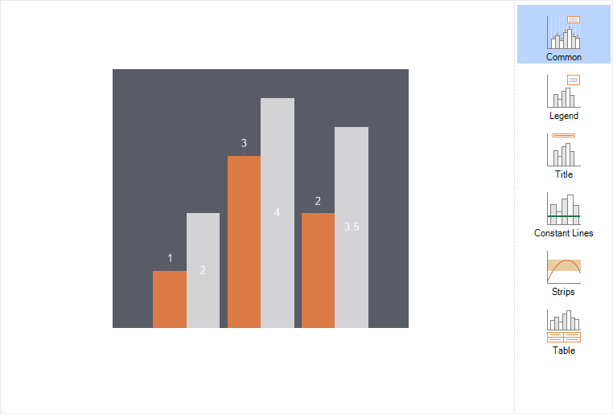

## Chart

The **Chart** tab is used to configure the chart's elements. These settings are divided into groups, each represented by a separate sub-tab.

The **Chart** tab includes a preview panel and several settings sub-tabs:
* Common contains properties of the **Chart** component;
* Legend contains settings for the chart's legend;
* Title contains settings for the chart's title;
* Constant Lines contains settings for constant lines in the chart;
* Strips contains settings for chart strips;
* Table contains settings for the chart's data table.
