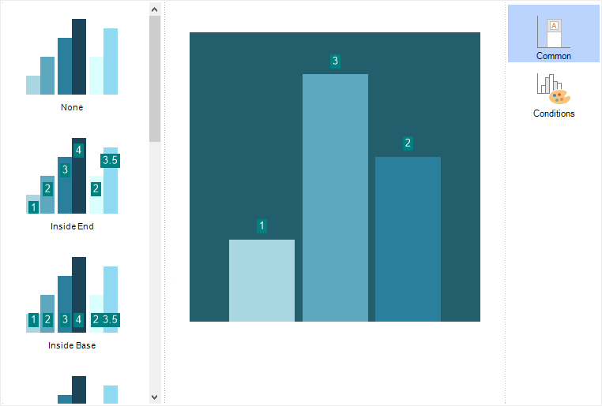

## Common

On the Common tab, the type of chart labels is defined, and their configuration is performed using various properties.

> **Information**
>
> Depending on the chart series, the type and number of labels may vary. Additionally, if labels are not needed, select the None type.

Labels will be applied to the values of all chart series where the Show Series Labels parameter is set to From Chart. This property can be modified on the Series tab, under the Series Labels section.

Below is a table of properties and their descriptions, which are used to configure series labels.

Name

Description

Allow Apply Style

Allows defining whether the title formatting settings will be used from the chart style. If the property is set to True, the title formatting will be taken from the chart style. If set to False, properties for manual title formatting will be displayed.

Angle

Allows rotating titles by a specified angle. The value can be positive or negative and represents the rotation angle in degrees. A positive value rotates the title to the right, while a negative value rotates it to the left.

Draw Border

Allows enabling or disabling the title border. If set to True, the border will be displayed. If set to False, the border will not be shown. Note that if the title formatting settings are taken from the chart style, this property will be irrelevant.

Format

Allows selecting a format mask (numeric, currency, percentage, etc.).

Legend Value Type

Allows defining the value to be displayed in the legend. The available options include Argument, Weight, Series Title, Tag, Series Value, or their combination.

Marker Alignment

Allows aligning the marker relative to the title. The marker can be positioned left, right, or centered. This property is relevant only if the marker display is enabled.

Marker Size

Allows changing the marker size in pixels. This property is relevant only if the marker display is enabled.

Marker Visible

Allows enabling or disabling the title marker. If set to True, the title marker will be displayed. If set to False, the title marker will not be shown.

Prevent Intersection

Allows avoiding title overlap. If set to True, titles will be arranged to prevent overlapping. If set to False, titles will be displayed even if they overlap.

Show in percent

Allows applying a P2 percentage format mask to title values.

Show Nulls

Allows enabling or disabling titles for null values. If set to True, titles for null values will be displayed. If set to False, they will not be shown.

Show Zeros

Allows enabling or disabling titles for zero values. If set to True, titles for zero values will be displayed. If set to False, they will not be shown.

Step

Allows defining the display step for titles. For example, if set to 2, titles will be displayed only for every second graphical element.

Text After

Allows specifying text after the title.

Text Before

Allows specifying text before the title.

Use Series Color

Allows setting the title color to match the series color. If set to True, the series color will be used (from the chart style or the Common tab). If set to False, the title color will be taken from the title style or the Color property.

Valu Type

Allows defining the value to be displayed in the graphical element title. The available options include Argument, Weight, Series Title, Tag, Series Value, or their combination.

Value Type Separator

Allows setting a separator if a mixed title type is used. For example, if both Value and Argument are displayed in the title, a separator like "-" can be used. In this case, the title will be displayed in the format "Value-Argument."

Visible

Allows enabling or disabling the title display. If set to True, the title will be shown. If set to False, the title will not be displayed.

Width

Allows specifying the title width. By default, the value is set to 0, meaning the title width is limited by the chart area.

Word Wrap

Allows enabling word wrapping for the title when the maximum width is reached. If set to True, the title text will wrap automatically. If set to False, text wrapping will not occur. This parameter is relevant only if the Width property is greater than zero.
