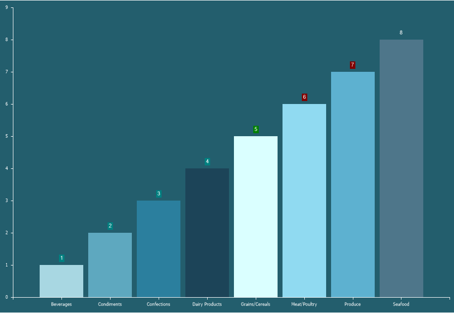

## Conditions

Conditional Formatting of Labels allows changing the background of labels when a specific condition is met.

To apply conditional formatting to labels, you need:
* In the component editor, go to the **Labels** tab and open the **Conditions** section;
* Click the **Add Condition** button;
* Configure the conditional formatting using the Condition Editor.

**Condition Editor**

In the Condition Editor, you can define the color that will be applied to the label background and specify the condition for applying this color.

 **Field Is** determines the field from which the original values will be taken—either from the series values or arguments.

 **Data Type** defines the data type of the condition value. This parameter affects how the report generator processes the condition and determines the list of available condition operations.

 **Condition** specifies the logical comparison operation between the series value and the condition value.

The type of operation by which the value of a condition is calculated.

 **Value** sets the specific value for the condition.

 **Color** defines the color to be applied to the label background when the condition is met.
