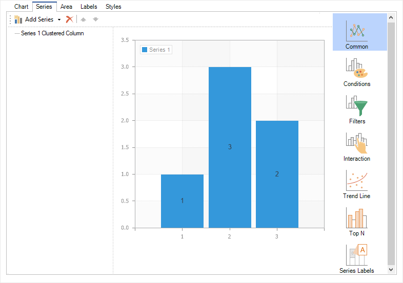

## Common

Common series settings are properties available in the Chart component editor under the Series tab, in the Main section.

> **Information**
>
> Depending on the series type, the available properties may vary.

Below is a table of the main series properties and their descriptions:

| **Name** | **Description** |
| --- | --- |
| Value Data Column | Specifies the column from the data source whose values will be used as the series values. |
| Value | Defines an expression whose result will be used as the value of the current series. |
| List of Values | Allows entering a single value or a list of values for the current series, separated by a semicolon ";". |
| Argument Data Column | Specifies the column from the data source whose values will be used as the series arguments. |
| Argument | Defines an expression whose result will be used as the argument of the current series. |
| List of Arguments | Allows entering a single argument or a list of arguments for the current series, separated by a semicolon ";". |
| Allow Apply Brush Negative | Enables applying a specific color (set to Brush Negative property) to negative values in the series. If True, all negative values will be displayed in the defined color. If False, negative values will use the series color. |
| Allow Apply Style | Enables using the series styling settings from the chart style. If True, the series appearance will be taken from the selected chart style. If False, additional styling properties such as color, border color, and brush settings will be available for customization. |
| Brush Negative | Specifies the color for negative values in the series. The Allow Apply Brush Negative property must be set to True for this setting to take effect. |
| Show in Legend | Enables or disables the display of the current series in the chart legend. If True, the series will appear in the legend. If False, it will not be shown. |
| Show Series Labels | Determines how series labels are configured—either from the chart settings or from the series itself. Detailed label settings are covered in the Series Labels section. |
| Show Zeros | Enables or disables the display of zero values in the chart. If True, zero values will be shown. If False, they will be hidden. It is important to note that for auto series, enabling or disabling null values is controlled by the Show Nulls property. |
| Title | Allows you to change the series title. |
| Width | Allows you to adjust the width of graphical elements. This property can be set to values from 0 to 1, where 0 represents the minimum width and 1 represents the maximum width. |
| Y Axis | Allows you to enable either the left or right Y-axis. - If set to Left Y Axis, the left Y-axis will be displayed on the chart. - If set to Right Y Axis, the right Y-axis will be displayed. |
| Format | Allows you to select a format mask for the series values. |
| Sort by | Determines the criteria for sorting graphical elements in the chart—either by values or by arguments. If set to None, no sorting is applied, and graphical elements will be displayed in the order they appear in the data source. |
| Sort Direction | Allows defining the sorting direction  Ascending  or Descending. |
| Auto Series Key Data Column | Allows specifying the data column whose unique values will be used to create the chart series. |
| Auto Series Color Data Column | Allows specifying the data column containing color values for the series that will be created automatically. |
| Auto Series Title Data Column | Allows specifying the data column whose values will be used as names for the series that will be created automatically. |
