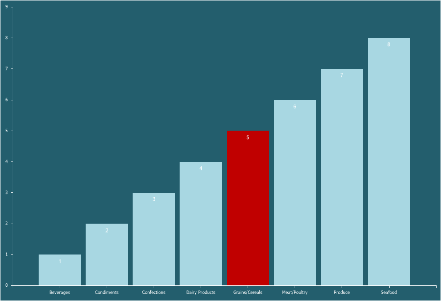
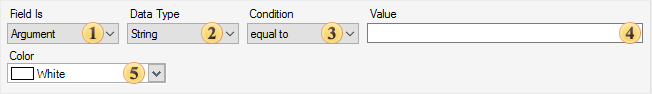

## Conditions

Conditional formatting for a series value involves applying a specific color to a graphical element within the current series.

To configure conditional formatting for series values, follow these steps:
* In the **Component Editor**, go to the **Series** tab, then the **Conditions** section;
* Click **Add Condition**;
* Configure the conditional formatting using the condition editor.

**Condition Editor**

The condition editor defines the color that will be applied to the graphical element and the condition for applying that color.

 **Field Is** determines the field from which the source values will be taken—either from the series values or arguments.

 **Data Type** defines the type of values used in the condition. This parameter affects how the report generator processes the condition and determines the list of available operations.

 **Condition** specifies the logical comparison operation between the series value and the condition value.

 **Value** defines the specific condition value.

 **Color** specifies the color that will be applied to the graphical element when the condition is met.
