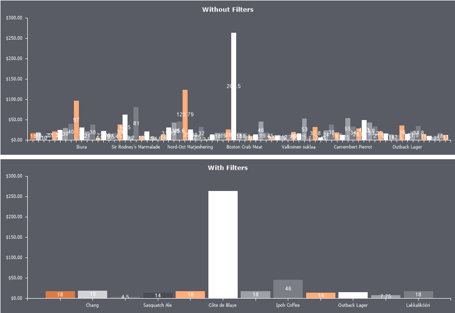
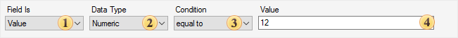

## Filters

Filtering series values involves selecting values based on a specific condition.

To apply filters to series values, follow these steps:
* In the component editor, go to the Series tab and select the Filters section;
* Click Add Filter;
* Configure the filtering condition using the filter editor.

Filter Editor
The filter editor defines the selection criteria for series values.

 Field Is determines the source of the values: Values, Arguments, or an Expression;

 Data Type defines the data type of both the source value and the filtering value;

 Condition specifies the filtering operation (see the table below);

 Value specifies the filtering value, i.e., the value for which the filter condition will be true.

> **Information**
>
> For some operations, multiple filtering values may be required. For example, if using the between operation, both a starting and ending value must be specified to define a range.

The list of available operations depends on the data type. Each operation defines a logical condition between the source value and the filtering value.

| String | Numeric | Date | Boolean |
| --- | --- | --- | --- |
| equal to | + | + | + |
| not equal to | + | + | + |
| between |  | + | + |
| not between |  | + | + |
| greater than |  | + | + |
| greater than or equal to |  | + | + |
| less than |  | + | + |
| less then or equal to |  | + | + |
| containing | + |  |  |
| not containing | + |  |  |
| beginning with | + |  |  |
| ending with | + |  |  |
