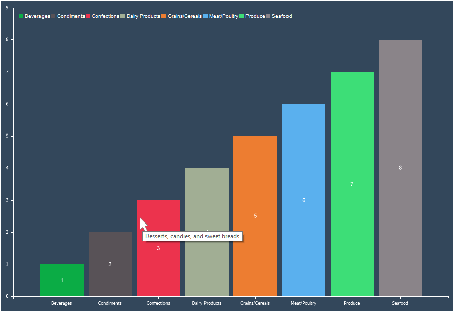

## Interaction

Interaction refers to specific actions performed on a series’ graphical elements when viewing a report.

To set up interaction for a chart series, you need:
* In the component editor, go to the **Series** tab and open the **Interaction** section;
* Configure the interaction settings using the available properties.
Interactions that can be customized:
* Drill-down on series elements or entire series;
* Hyperlinks for series values;
* Tags for series values;
* Tooltips for series values.

Below is a table with a list of properties that are used to customize the interaction.

| **Name** | **Description** |
| --- | --- |
| Allow Series | Enables or disables drill-down for the entire series rather than individual values. If set to **True**, drill-down for the whole series is allowed. If set to **False**, drill-down for the entire series is disabled. This is only applicable if **Drill-Down Enabled** is set to **True**. |
| Allow Series Elements | Enables or disables drill-down for individual series elements. If set to **True**, each graphical element can be drilled down separately. If set to **False**, drill-down for individual elements is disabled. This is only applicable if **Drill-Down Enabled** is set to **True**. |
| Drill-Down Enabled | Enables or disables drill-down mode. If set to **True**, drill-down is enabled, and the series elements are interactive in the viewer. If set to **False**, drill-down is disabled, and series elements are non-interactive. |
| Drill-Down Page | Specifies the report template page containing the drill-down data. |
| Drill-Down Report | Specifies an external report containing the drill-down data. |
| Hyperlink Data Column | Specifies the data column containing hyperlinks for the series’ graphical elements. |
| Hyperlink | Defines an expression that evaluates to a hyperlink for the series’ graphical elements. |
| List of Hyperlink | Specifies a hyperlink or a list of hyperlinks for the series’ graphical elements. Hyperlinks should be separated by ";". The order of hyperlinks corresponds to the order of series values. |
| Tag Data Column | Specifies the data column containing tags for the series’ graphical elements. |
| Tag | Defines an expression that evaluates to a tag for the series’ graphical elements. |
| List of Tags | Specifies a tag or a list of tags for the series’ graphical elements. Tags should be separated by ";". The order of tags corresponds to the order of series values. |
| Tool Tip Data Column | Specifies the data column containing tooltips for the series’ graphical elements. |
| Tool Tip | Defines an expression that evaluates to a tooltip for the series’ graphical elements. |
| List of Tool Tips | Specifies a tooltip or a list of tooltips for the series’ graphical elements. Tooltips should be separated by ";". The order of tooltips corresponds to the order of series values. |

> **Information**
>
> Drill-down in charts does not support passing parameters. However, to filter drill-down data correctly, you can pass a tag of the graphical element or series.
