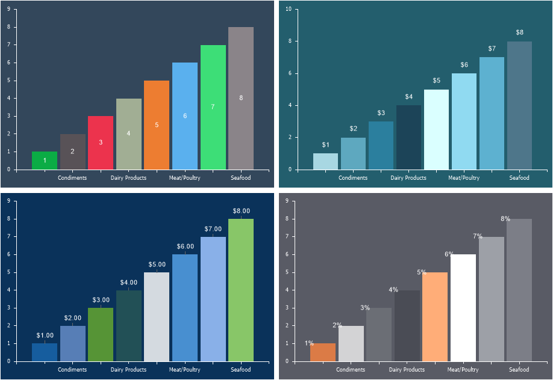

## Labels

Series Labels are a visual representation of values, arguments, tags, series names, and their combinations on or near graphical elements of series.

Series label settings can be obtained from:
* Chart label settings.
* Settings for the current series.
To configure the labels for the current series:
* In the component editor, go to the Series tab and find the Series Labels group;
* Set the Show Series Labels parameter to From Series;
* Select the placement type for the labels;
* Adjust the label settings using the available properties.

> **Information**
>
> Depending on the chart series, the type and number of labels may vary. If labels are not required, select the None option.

Below is a table of properties and their descriptions used to configure series labels.

| Name | Description |
| --- | --- |
| Allow Apply Style | Allows defining whether the label formatting settings will be taken from the chart style. If the property is set to True, the label formatting settings will be applied from the chart style. If the property is set to False, properties for manual label formatting will be displayed. |
| Angle | Allows rotating labels at a specific angle. The value is set as a positive or negative number and represents the rotation angle in degrees. A positive value rotates the label to the right, while a negative value rotates it to the left. |
| Draw Border | Allows displaying or hiding the label border. If the property is set to True, the border will be displayed. If set to False, the border will not be displayed. Note that if label formatting settings are taken from the chart style, this property will not be relevant. |
| Format | Allows selecting a format mask (numeric, currency, percentage, etc.). |
| Legend Value Type | Allows defining the value displayed in the legend. The following values can be selected: Argument, Weight, Series Title, Tag, Series Value, or their combinations. |
| Marker Alignment | Allows aligning the marker relative to the label. The marker can be positioned to the left, right, or center of the label. This property is relevant if marker display is enabled. |
| Marker Size | Allows changing the marker size in pixels. This property is relevant if marker display is enabled. |
| Marker Visible | Allows displaying or hiding the label marker. If the property is set to True, the label marker will be displayed. If set to False, the label marker will not be displayed. |
| Prevent Intersection | Allows avoiding label overlap. If the property is set to True, labels will avoid overlapping. If set to False, labels may overlap. |
| Show in percent | Allows applying a percentage format mask P2 to label values. |
| Show Nulls | Allows displaying or hiding labels for null values. If the property is set to True, labels for null values will be displayed. If set to False, labels for null values will not be displayed. |
| Show Zeros | Allows enabling or disabling the display of titles for zero values. If set to True, titles for zero values will be displayed. If set to False, titles for zero values will not be displayed. |
| Step | Defines the step for displaying titles. For example, if set to 2, titles will be displayed only for every second graphical element. |
| Text After | Specifies the text to be added after the title. |
| Text Before | Specifies the text to be added before the title. |
| Use Series Color | Allows setting the title color to match the series color. If set to True, the series color (from the chart style or the Main tab) will be used. If set to False, the title color will be taken from the title style or the Color property. |
| Value Type | Defines the value displayed in the title of a graphical element. The following options can be selected: Argument, Weight, Series Title, Tag, Series Value, or their combinations. |
| Value Type Separator | Allows setting a separator if a mixed title type is used. For example, if the title displays Value and Argument, a separator like "-" can be used. In this case, the title will be displayed as "Value-Argument". |
| Visible | Enables or disables title display. If set to True, the title will be displayed. If set to False, the title will not be displayed.  Enables or disables title display. If set to True, the title will be displayed. If set to False, the title will not be displayed. |
| Width | Specifies the title width. The default value is 0, meaning the title width is limited by the chart area. |
| Word Wrap | Enables text wrapping for titles when the maximum width is reached. If set to True, text wrapping will be applied. If set to False, text wrapping will not be applied. This parameter is relevant only if the Width property is greater than zero. |
