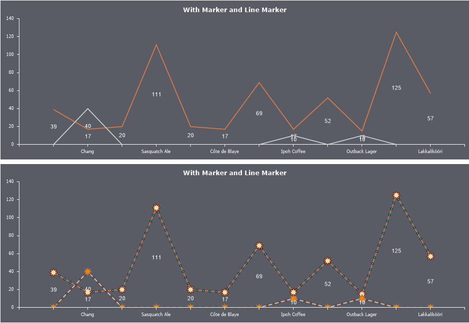

## Line Marker

A Line Marker is a graphical symbol used to display intermediate values along a line between the nearest series values. Line markers are available only for line-based charts, including Line, Area, Range, and their variations.

To apply line markers to a chart series, follow these steps:
* In the component editor, go to the Series tab and open the Line Marker section;
* Configure the line marker’s appearance using its properties.

> **Information**
>
> If a style is applied to the chart, the line marker’s appearance settings will be inherited from that style. Before customizing the line marker in the Line Marker tab, set the Allow Apply Style property to False in the Common tab.

Below is a table of properties that are used to configure the line marker.

| Name | Description |
| --- | --- |
| Border Color | Allows you to change the line marker’s border color. |
| Brush | Allows you to change the brush type and the fill color of the line marker. |
| Angle | Allows you to rotate the line marker by a specific angle. The value can be positive or negative, representing the rotation angle in degrees. A positive value rotates the marker to the right, while a negative value rotates it to the left. |
| Size | Defines the size of the line marker. |
| Step | Defines the interval at which the line marker is displayed, i.e., the number of pixels between each marker along the line.Defines the interval at which the line marker is displayed, i.e., the number of pixels between each marker along the line. |
| Type | Allows you to select the geometric shape of the line marker. |
| Visible | Enables or disables the display of the line marker on the chart. If set to True, the line marker will be visible. If set to False, it will not be displayed. |
