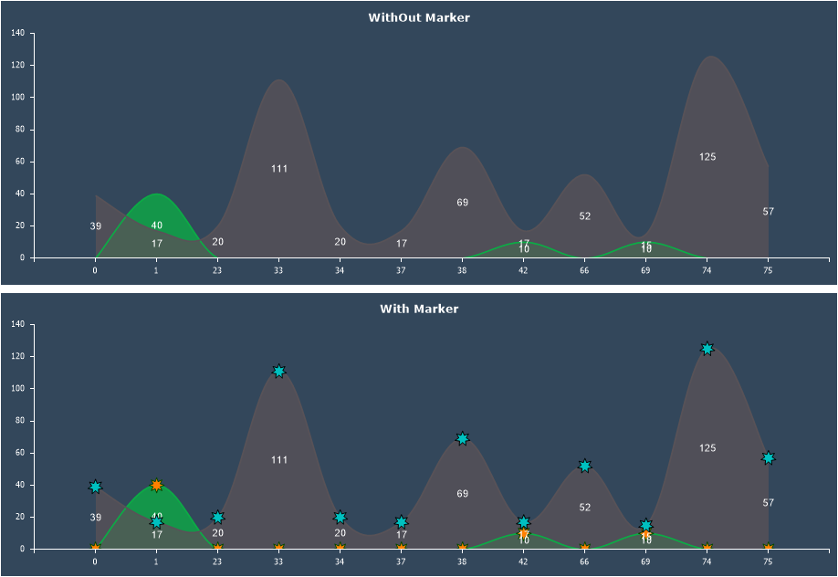

## Marker

A **Marker** is a graphical symbol used to display series values on a chart. Markers are available only for line-based charts, including Line, Area, Range, Scatter, Radar, and their variations.

To apply a marker to a chart series, follow these steps:
* In the component editor, go to the **Series** tab and open the **Marker** section;
* Configure the marker’s appearance using its properties.

> **Information**
>
> If a style is applied to the chart, the marker's appearance settings will be inherited from that style. Before customizing the marker in the Marker tab, set the **Allow Apply Style** property to **False** in the Common tab.

Below is a table of properties that are used to configure the marker.

| **Name** | **Description** |
| --- | --- |
| Border Color | Allows you to change the marker’s border color. |
| Brush | Allows you to change the brush type and the fill color of the marker. |
| Angle | Allows you to rotate the marker by a specific angle. The value can be positive or negative, representing the rotation angle in degrees. A positive value rotates the marker to the right, while a negative value rotates it to the left. |
| Size | Defines the marker’s size in pixels. |
| Type | Allows you to select the marker's geometric shape: rectangle, triangle, circle, star, hexagon. |
| Visible | Enables or disables the display of the marker on the chart. If set to **True**, the marker will be visible. If set to **False**, the marker will not be displayed. |
