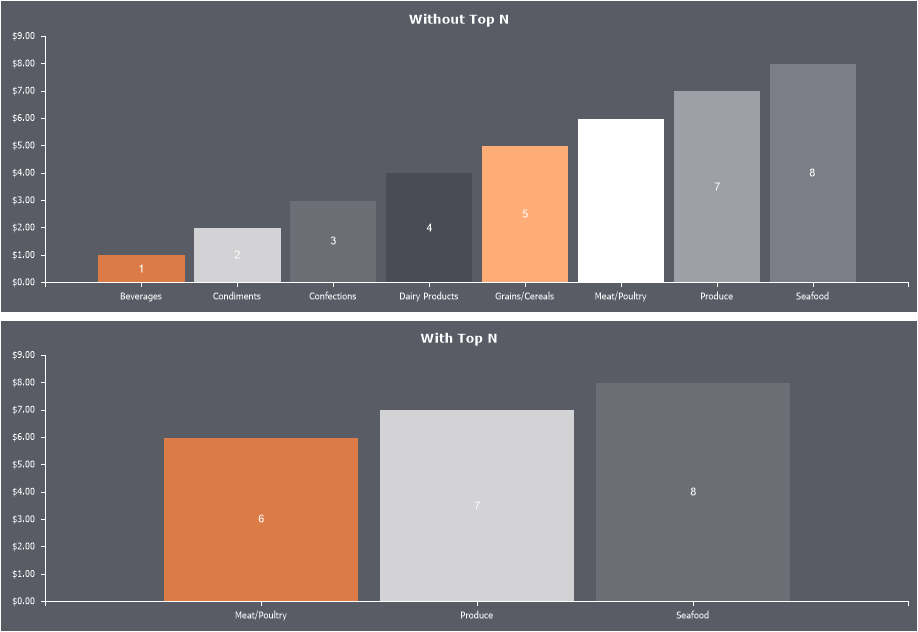

## Top N

One of the options for filtering, analyzing, and grouping data series is the ability to display the top values on a chart.

To configure the top values of a series, follow these steps:
* In the component editor, go to the Series tab and select the Top N tab;
* Use the available properties to configure the display of top values.

Below is a table of properties and their descriptions used to configure the top values.

Name

Description

Count

Defines the number of top values to display.

Mode

Determines the mode of values. If set to Top, the highest values will be displayed. If set to Bottom, the lowest values will be displayed. If set to None, top values will not be displayed.

Others Text

Specifies the label for the sum of other values, i.e., the series values that do not fall into the top values list.

Show Others

Enables or disables the display of the sum of other values as a separate graphical element. If set to True, other values will be summed and displayed as a separate series element. If set to False, the sum of other values will not be displayed, meaning only the top values will be shown.
