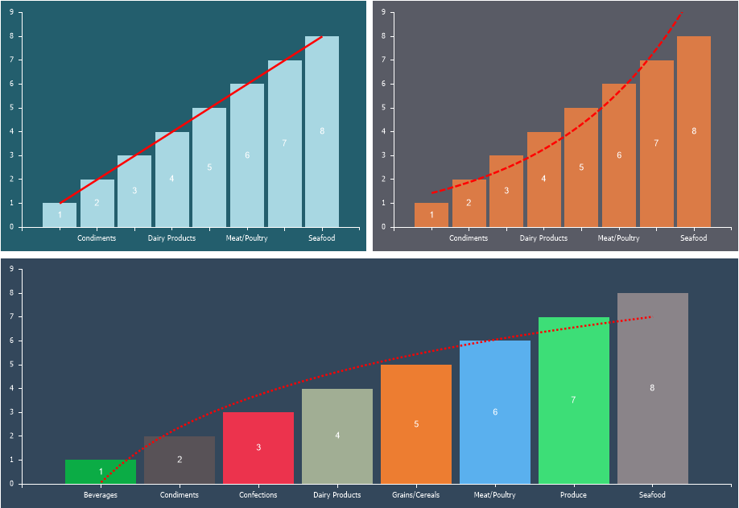

## Trend Line

One of the options for data analysis and forecasting is the ability to overlay a trendline on a chart. Depending on the type, the trendline allows displaying the dependence of the series values on its arguments. A trendline can be applied to non-accumulating series, bar charts, histograms, scatter plots, and bubble charts.

To add a trend line to a chart, you need:
* In the component editor, go to the **Series** tab and select the **Trend Line** section;
* Choose the type of trend line and configure its settings using the available properties.

The type of trend line defines the relationship between values and arguments. The following types of trend lines are available:
* **Linear**.

* **Exponential**.
* **Logarithmic**.

Below is a table of properties that configure the selected trendline type.  Below is a table of properties that configure the selected trendline type.

| **Name** | **Description** |
| --- | --- |
| Allow Apply Style | Enables the use of trendline styling settings from the chart style. If set to **True**, the trendline will adopt the style settings of the chart. If set to **False**, properties for customizing the trendline's appearance (such as line color and shadow) will be displayed. |
| Line Style | Allows changing the line style: **Solid**, **Dash**, **Dash Dot**, **Dash Dot Dot**, **Dot**, **Double**. If **None** is selected, the trendline will not be displayed on the chart. |
| Line Width | Allows adjusting the trendline thickness. By default, the line width is set to 1 pixel. |
