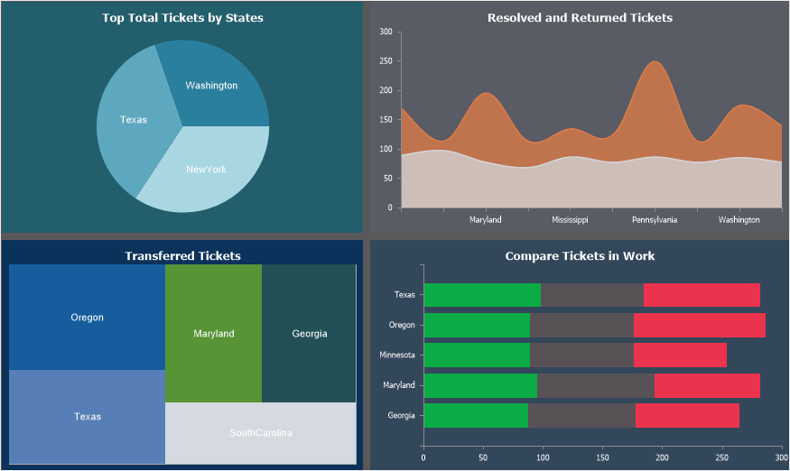
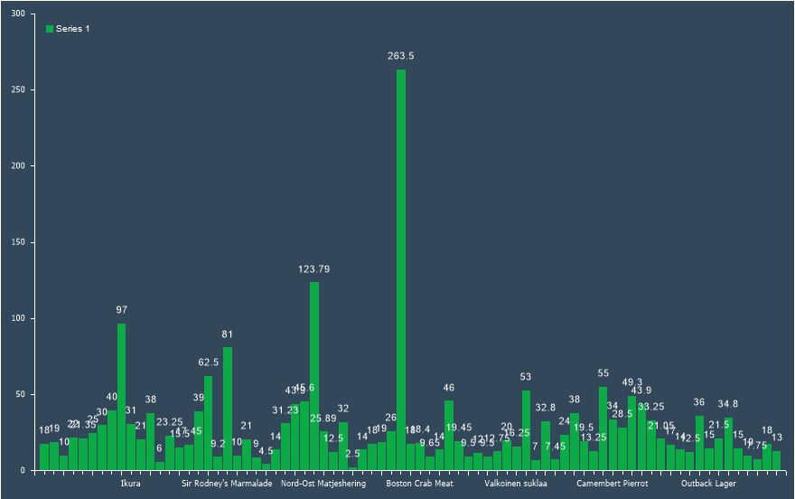
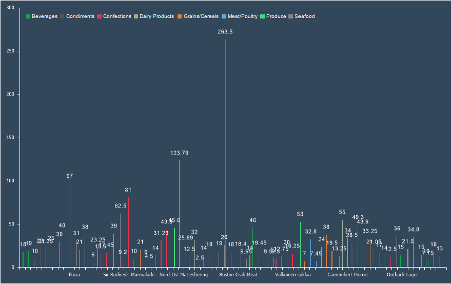

## Series

Series is a visual representation of data using graphical elements of a specific type.

To create a chart element, you need to create a Series of a specific type. When selecting a chart in the toolbox or on the Insert tab, a component will be created with a series of the chosen type. Additionally, series can be added manually:
* In the Component Editor, go to the Series tab, then the Common section.
* Click the Add Series button and select the required type.

> **Information**
>
> When designing charts in reports, automatic series creation can also be used.

After creating a series, you need to specify data for it. For some series types, only a value is required, while others require values and arguments, or even multiple values along with arguments, etc. Series configuration, like chart configuration, is done in the component editor. Data columns (for values and arguments) can be specified as follows:
* In the component editor, go to the Series tab and select the Main section;

* Select the series and click the Browse button next to the Value Data Column and Argument Data Column properties;
* Choose the data columns for values and arguments.

To define expressions for series values and arguments:

* In the component editor, go to the Series tab and select the General section;

* Select the series and enter expressions for Value and Argument properties.
To define a single value or a list of values and arguments:

* In the component editor, go to the Series tab and select the General section.

* Select the series and enter a single value or a list of values in the List of Values and List of Arguments fields, separating them with a semicolon ";".

> **Information**
>
> When manually entering lists of values and arguments, the ordinal number of a value in the list corresponds to the ordinal number of the argument in the argument list.

Automatic Series Creation

When designing charts, series can be created automatically. In this case, a series will be generated for each unique value from the selected data column.

To create series automatically:
* In the Component Editor, go to the Series tab, then the Common section;

* Click Add Series and select the series type;
* Click Browse next to the Auto Series Key Data Column property and select a data column. Now, a series will be created for each unique value in this column.

Additionally, when creating series automatically, you can:
* Set series titles. Select a data column as the Auto Series Title Data Column property. Values from this column will be used as series titles. The title for a particular series is taken from the value associated with the unique value of the column specified in Auto Series Key Data Column;

* Define series colors. Select a data column as the Auto Series Color Data Column property. The color should be stored in the data source in #FFFFFF format. The color for a particular series is taken from the value associated with the unique value of the column specified in Auto Series Key Data Column.
