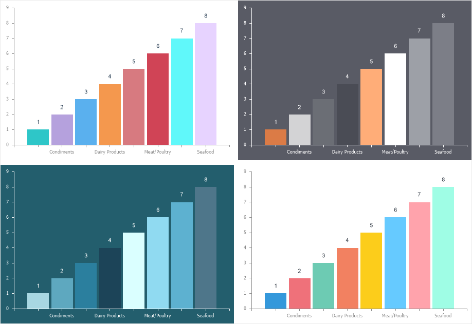
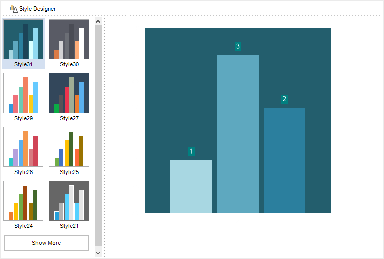

## Style

A chart style is a collection of formatting settings for various elements of the chart component. At any given time, only one style can be applied to a chart. However, for certain chart elements, individual formatting can be customized by disabling the style application.

When designing reports with charts, more than 30 built-in styles are available for this component. You can change the **Chart** component style by:
* Selecting the component in the report template and choosing a style using the quick style selection menu on the **Home** tab of the report designer’s Ribbon panel;
* Opening the component editor, navigating to the **Styles** tab, and selecting the desired style from the list.

For the **Chart** component, the following can be used:
* A predefined style;
* A custom style, created in the style designer;
* A combined style, where a predefined style is applied first, and then specific elements are customized manually in the **Chart** component editor.

> **Information**
>
> The key property that determines where the formatting settings for chart elements are taken from is Allow Apply Style. If set to **True**, the chart element settings will be taken from the assigned style. If set to **False**, the formatting must be manually defined using properties in the Chart component editor.
