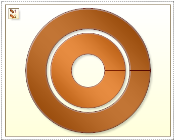
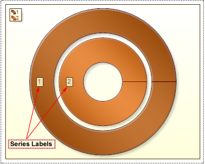

## Series Labels

**Series Labels** can only be placed in the center on the doughnut chart. The **Series Labels** may have two values: **None** and **Center**. If the **Series Labels** property is set to **None**, then labels are not shown. The picture below shows the doughnut with no labels:

If the **Series Labels** property is set to **Center**, then labels are shown in the center of the chart ring. The picture below shows the doughnut with labels:

