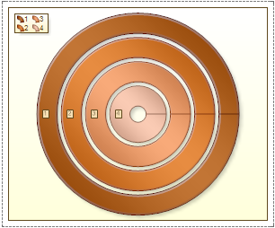

## Doughnut

The Doughnut chart is circular chart divided into sectors. It has a blank center and the ability to support multiple statistics as one. Doughnut illustrates proportion. On the picture below the doughnut chart sample is represented:

