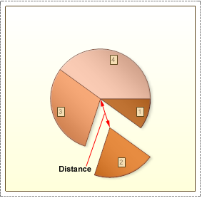
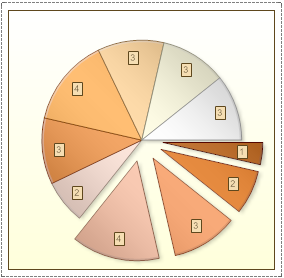

## CutPieList Property

The Pie chart represents an opportunity to display the contribution of each value to a total while emphasizing individual values. To select a segment in a pie chart select and pull out, it is necessary, in the **Series Editor**, to specify values for the **Distance** and **CutPieList** properties of a series. The **Distance** property indicates is the distance from the center of the chart to the nearest point of the pull out segment. The **CutPieList** property has a list of series to be pulled out, separated with **';'**. The picture below shows an example of a pie chart, with the second slice of the first series pulled out. The distance is 60-hundredths of inches:

If the field of the **CutPieList** property is filled, and the field of the **Distance** property is not filled, then the segments will not be pulled out. If the field of the **Distance** property is filled, and the field **CutPieList** property is not filled, then all segments of this series will be pulled out to the distance, which corresponds to the value of the **Distance** property. The picture below an example of a chart with all segments of the series 1 being pulled out, because the field of the **CutPieList** property was not filled, and the **Distance** property set to 30-hundredths of an inch:

