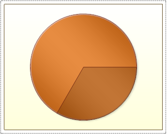
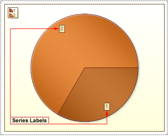
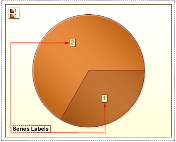
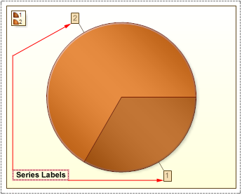
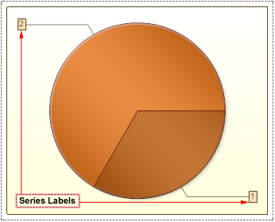

## Series Labels

The location series labels, in the pie chart, depends on the value of the **SeriesLabels** property. This property may take the following values: None, Inside End, Center, Outside, Two Columns.

* **None**. Series Labels are not shown. The picture below shows an example of a Pie chart with the **Series Labels** set to **None**:

* **Inside End**. Series Labels are displayed inside the slice and far from the center. The picture below shows an example of a Pie chart with the **Series Labels** set to **Inside End**:

* **Center**. Series Labels are displayed in the center of the slice. The picture below shows an example of a Pie chart with the **Series Labels** set to **Center**:

* **Outside**. Series Labels are displayed outside the chart, but in a Pie area. The picture below shows an example of a Pie chart with the **Series Labels** set to **Outside**:

* **Two Columns**. Series Labels are displayed outside the chart in two columns: on the left and right of the chart. The picture below shows an example of a Pie chart with the **Series Labels** set to **Two Columns**:

