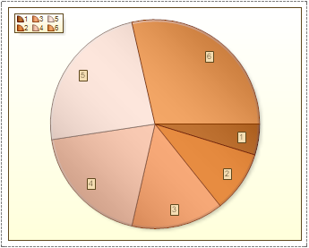

## Pie

The Pie chart (or a circle graph) is circular chart divided into sectors, illustrating proportion. Each Series is a part of chart. In a pie chart, each sector, is proportional to the quantity it represents. Together, the sectors create a full disk.

