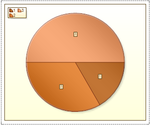
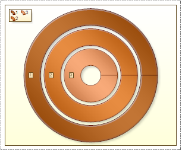

## Area

Circular area or area without axes is a space where charts can be placed without axes. A circular area includes the main elements of the chart: series, chart title and a legend. In the area without axes the following chart types may be placed: Pie and Doughnut. The difference between these types of charts is that, for Pie type of a chart, rows are arranged in series. And for the Doughnut chart - rings. The picture below shows an example of a Pie chart, with three series:

As can be seen from the picture, the series are arranged consecutively in a clockwise direction. In the Doughnut chart, the number of rows will match the number of rings. The picture below shows an example of a chart that has three rows:

