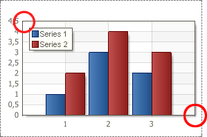
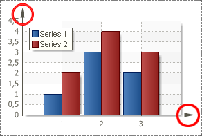

## ArrowStyle Property

Each axis has its own direction. The direction is identified with marker (usually it is an arrow). To change the arrow style, use the Arrow Style property of an axis. The path to this property is Area.Axes.ArrowStyle. On the picture below the sample of a rendered chart with the ArrowStyle property set to the None default value:

As you can see, if the ArrowStyle property is set to None, then X  Y axes do not have style. The ArrowStyle property can be set to Triangle. In this case the arrow style will look like on the picture below:

The ArrowStyle property can be set for each axis. Each axis may have its own values of the Arrow Style property. On the picture below different values of the ArrowStyle property of Х and Y axes:

As seen from the picture above, the ArrowStyle property, of the Y axis is set to Triangle. And the ArrowStyle property, of the X axis is set to Lines.
