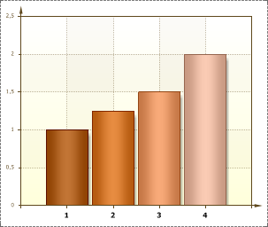

## Angle Property

The **Angle** property is used to change the inclination of **Labels**. Specifies the angle, in degrees. The **Angle** property is set separately for each axis. The full path to this property is **Area.Axis.Labels.Angle**. By default, the value of the **Angle** property is set to **0.** So **Labels** are placed as it is shown on the picture below:

The value of this property can be negative and positive. If the value of the property is negative then Label is inclined clockwise. If the value of the property is positive then Label in inclined anticlockwise. The picture below shows the chart sample, which Angle property by the **Х** axis is set to **50**:

