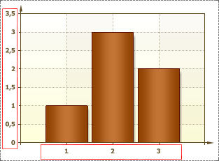
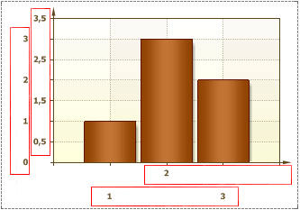
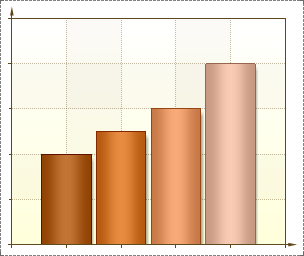

## Placement Property

The Placement property is used to change position of labels. The full path to this property is Area.Axis.Labels.Placement. This property has three values: One Line, Two Lines, None.

* One Line. In this case, labels are placed in a line horizontally or vertically, depending on the X or Y axis, respectively. The picture below shows an example of a chart, with the Placement property set to One Line for of X and Y axes:

* Two Lines. In this case, labels are placed in two lines horizontally or vertically, depending on the X or Y axis, respectively. The picture below shows an example of a chart, with the Placement property set to Two Lines for of X and Y axes:

* None. In the case labels are not shown. The picture below shows an example of a chart, with the Placement property set to None for of X and Y axes:

By default, the Placement property is set to One Line.
