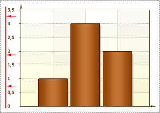
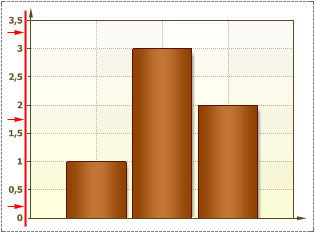

## TextAlignment Property

The TextAlignment property is used to align labels on the chart or by Y axis. The full path to this property is Area.Axis.Labels.TextAlignment. If the TextAlignment property set to Left, then labels are aligned by the chart edge. The picture below shows an example of chart with the of TextAlignment property set to Left:

If the TextAlignment property set to Right, then the labels are aligned by the Y axis. The picture below shows an example of chart with the of TextAlignment property set to Right:

By default, the TextAlignment property is set to Right.
