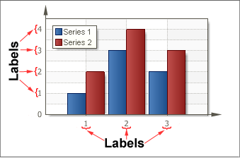

## Labels

Labels are titles of X axis (the axis of the arguments) and Y (the axis values). Labels can take any string value. Any string value is transformed according to the selected format. If the report generator failed to convert a value to the selected format, then a direct string value is output. The picture below shows an example of a chart with arguments of Labels. The Format property is set to N:

Also, Labels have a number of properties such as:

 **Angle** - sets an angle of inclination of labels;

 **Antialiasing** -  sets smooth-edged type of  labels;

 **Color** - sets the labels color;

 **Font** - sets the font type of labels;

 **Format** - changes the label format (numeric, percentage etc);

 **Placement** - changes the position of showing Labels;

 **Text before/Text after** - shows a text before/after Labels;

 **Text Alignment** - used for **Y** axis, aligns Labels;

 **Width** - changes the width of Label.
