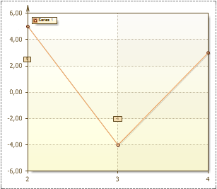
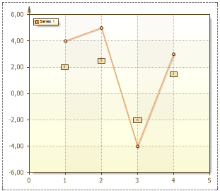

## Range Property

The **Range** property is used to display the specified section of a chart. So a part of the chart within the specified values will be shown. The picture below shows a chart with the Range property set to the X-axis from 2 to 4:

The Range consists of the values of three fields:

* **Auto**. If the Auto field is set to true, then a chart is shown entirely, the range of values will be calculated automatically. The picture below shows an example of it:

If the **Auto** field is set to **false**, then all values of the range which are specified in the **Minimum** and **Maximum** fields are considered. If the **Auto** field is set to **false**, and values the **Minimum** and **Maximum** fields are set to 0, then the chart will be shown entirely.

* **Minimum** - sets the beginning of the range.

* **Maximum** - sets the end of the range.

If the **Maximum** value is less then the **Minimum** value, then the chart will be displayed entirely.
